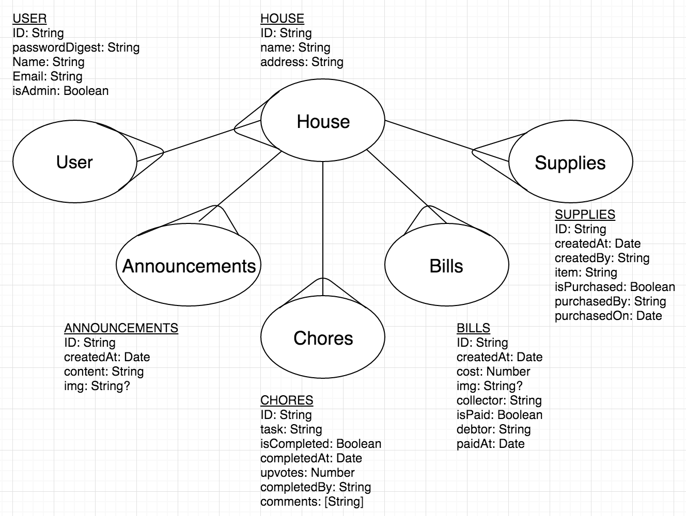

# Roommate App #

# Overview #

Manage your household/workspace/annoying roommates in one simple app. 
Upvote chores and keep track of who's doing what, when.
Create lists of household supplies that need to be purchased.
Post household announcements.
<br>

## Development ##

### Initial wireframes: ###

<br>
<br>
<br>

<br>
<br>
<br>

<br>
<br>
<br>

<br>
<br>
<br>

### User Stories ###

https://trello.com/b/ZFWVDd2G/domain

### Technologies Used ###

<ul>
<li>Technologies used include HTML5/CSS3, JavaScript, Angular, Express, Ionic, Cordova, Sass, Gulp, MongoDB, Mongoose, and Node.js.</li>
<li>Project planning with help from <a href="https://trello.com/">Trello</a>.</li>
</ul>

### Installation ###

Deployed App:
https://arcane-sea-78462.herokuapp.com

<br>

## Features To Be Added ##

<ul>
	<li>Manage bills using Splitwise API</li>
	<li>UX/UI features</li>
	<li>User Profiles</li>
	<li>Household Management</li>
	<li>Version 2.0 coming soon</li>
</ul>

## Contributions ##

Contributions are welcome! Fork this repository, make your changes and submit any and all pull requests.

Make sure the `ionic` utility is installed:

```bash
$ npm install -g ionic
```

Then run:

```bash
$ ionic start myProject tabs
```

More info on this can be found on the Ionic [Getting Started](http://ionicframework.com/getting-started) page and the [Ionic CLI](https://github.com/driftyco/ionic-cli) repo.
